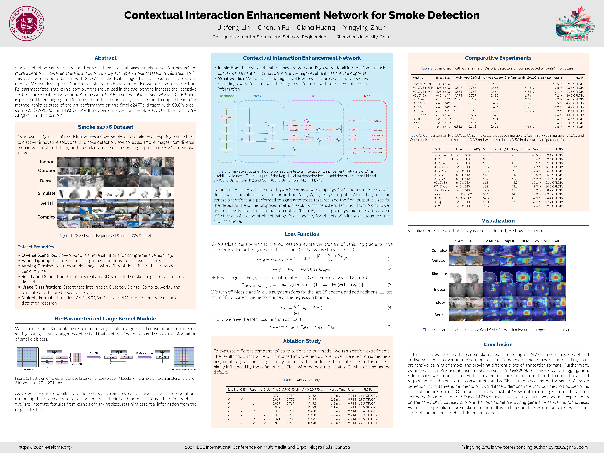
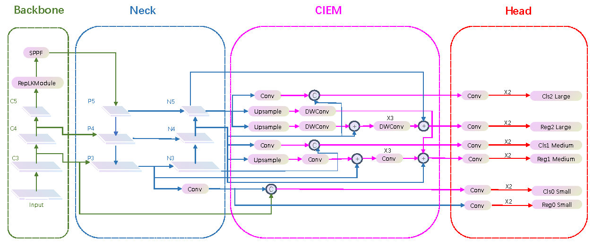
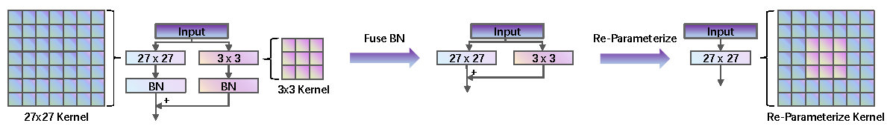
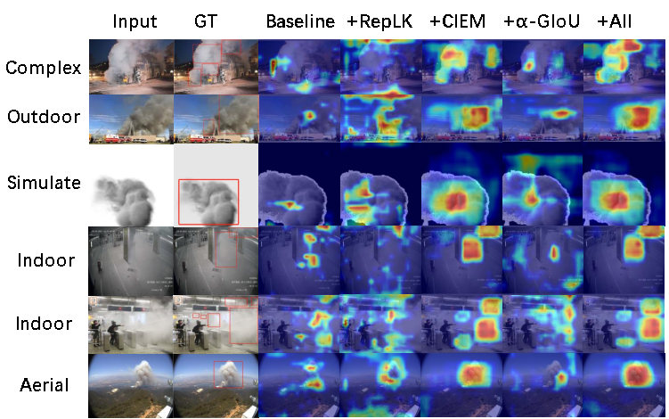

# Contextual Interaction Enhancement Network for Smoke Detection
## 1. 目录结构
- 📂 `Smoke24776_coco_format/`：COCO 格式相关文件
  - 📂 `annotations/`：[COCO 格式标注文件](./Smoke24776_coco_format/annotations/)
  - 📂 `train/`：[训练图像文件](./Smoke24776_coco_format/val/)
  - 📂 `val/`：[验证图像文件](./Smoke24776_coco_format/train/)
- 📂 `Smoke24776_voc_format/`：VOC 格式相关文件
  - 📂 `Annotations/`：[VOC 格式标注文件](./Smoke24776_voc_format/Annotations/)
  - 📂 `ImageSets/`：[VOC 数据集划分文件](./Smoke24776_voc_format/ImageSets/)
  - 📂 `JPEGImages/`：[VOC 格式图像文件](./Smoke24776_voc_format/JPEGImages/)
- 📂 `Smoke24776_yolo_format/`：YOLO 格式相关文件
  - 📂 `labels/`：[YOLO 格式标注文件](./Smoke24776_yolo_format/labels/)
  - 📂 `images/`：[YOLO 格式图像文件](./Smoke24776_yolo_format/images/)
- 📂 `Smoke24776_images_by_types/`：按类型分类的示例图像
  - 📂 `Aerial/`：[航空分类图像](./Smoke24776_images_by_types/Aerial/)
  - 📂 `Complex/`：[复杂场景分类图像](.Smoke24776_images_by_types/Complex/)
  - 📂 `Dense/`：[密集烟雾分类图像](.Smoke24776_images_by_types/Dense/)
  - 📂 `Indoor/`：[室内场景分类图像](.Smoke24776_images_by_types/Indoor/)
  - 📂 `Outdoor/`：[室外场景分类图像](.Smoke24776_images_by_types/Outdoor/)
  - 📂 `Simulated/`：[模拟烟雾分类图像](.Smoke24776_images_by_types/Simulated/)
- 📂 `assets/`：[辅助资源（如封面图、示意图等）](./assets/)
- 📂 `tool_scripts/`：[工具脚本（格式转换、数据处理等）](./tool_scripts/)
- 📄 `LICENSE`：[开源许可证文件](./LICENSE)
- 📄 `README-en.md`：[英文说明文档](./README-en.md)
- 📄 `README.md`：[中文说明文档](./README.md)
## 2. 项目简介

<!-- 

 -->
## 3. 完整数据集图像获取方式
|    | 链接 |密码|
|:---|:----:|---:|
|百度网盘| [链接](https://pan.baidu.com/s/19hBmTecDicXTmkRSCaET9Q?pwd=w3e4) | w3e4 |
|阿里云|[链接](https://pan.baidu.com/s/19hBmTecDicXTmkRSCaET9Q?pwd=w3e4)|/|
|Google Drive|待上传|/|
## 4. 注意事项
- 对于此数据集，本仓库只包含COCO格式、VOC格式和YOLO格式的标注文件，图像数据需要通过链接下载。
- 除了这三种格式的数据集，本仓库还有根据场景将数据集分为Aerial、Complex、Dense、Indoor、Outdoor和Simulated六种类型，图像数据同样包含在下载链接中。
- 由于 GitHub 存储限制，仓库仅包含示例图像，完整 24776 张图像需从阿里云盘、百度网盘或 Google Drive 等外部链接下载（详见上方）。
- 对于VOC格式的数据集，请自己进行划分训练集、验证集、测试集。
- 本数据集（Smoke24776）基于 MIT 协议开源，允许非商业与商业场景使用，但需在衍生作品或研究成果中保留原版权声明（标注 “Copyright (c) 2024 Jiefeng Lin, Chenlin Fu, Qiang Huang, Yingying Zhu of Research Institute for Future Media Computing, Shenzhen University”），禁止移除或修改数据集中的版权信息。
- 禁止将数据集用于恶意用途，包括但不限于虚假火灾预警系统开发、未经授权的隐私场景监控、生成误导性视觉内容等，若违反此规范，需承担相应法律责任。 
## 5. 引用方式
Jiefeng Lin, Chenlin Fu, Qiang Huang, Yingying Zhu. Contextual Interaction Enhancement Network for Smoke Detection. In Proceedings of the IEEE International Conference on Multimedia and Expo (ICME), 2024. https://github.com/linjiefengFutureMediaSZU/Smoke24776
## 6. 开源协议
本数据集、标注文件及配套代码基于MIT License开源，详情见LICENSE文件。
## 7. 联系方式
- 主要联系人：Jiefeng Lin（jayphonepersonal@gmail.com）
- 通讯作者：Yingying Zhu（zyyszu@gmail.com）
- 问题反馈：GitHub Issues（优先）或上述邮箱
- 本工作得到以下项目资助：
- 国家自然科学基金（62072318、U22A2079）
- 广东省教育厅重点项目（2023ZDZX1016）
- 深圳市科技计划项目（20220810142553001）
